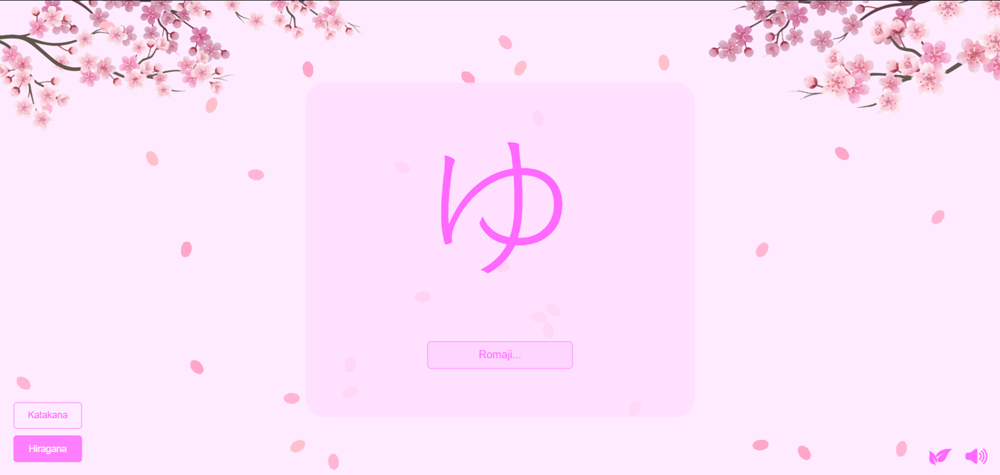

# 🌸 HanaNoKana



Projeto educacional para aprender os alfabetos japoneses **Hiragana** e **Katakana** de forma interativa.  
Interface simples, animações suaves e um ambiente acolhedor... O HanaNoKana é ideal para quem está dando os primeiros passos no japonês.  

Este projeto surgiu a partir do curso de japonês oferecido pelo **Centro de Línguas do IFPR – CELIF**, no Campus Paranavaí, realizado durante o ano de **2025**. A ideia nasceu como um complemento aos estudos, buscando criar uma ferramenta leve, acessível e visualmente agradável para apoiar estudantes que desejam praticar a escrita e a leitura dos kana de forma divertida.  

👉 Experimente online: [https://rSanches35.GITHub.io/HanaNoKana/](https://rSanches35.github.io/HanaNoKana/)

---

## ✨ Funcionalidades

- 📖 Visualização dos alfabetos **Hiragana** e **Katakana**
- 🖊️ Animações mostrando o traçado de cada caractere
- 🎨 Interface responsiva e amigável
- 🌸 Estética inspirada em flores de cerejeira
- 🔊 Efeitos sonoros: pequenos sons para feedback de interação

---

## 🚀 Como usar

Clone o repositório e abra no navegador:

```bash
# Clonar o projeto
git clone https://github.com/rSanches35/HanaNoKana.git

# Acessar a pasta
cd HanaNoKana

# Abrir no navegador
index.html
```

Ou simplesmente acesse pelo link:  
👉 [https://rSanches35.GITHub.io/HanaNoKana/](https://rSanches35.github.io/HanaNoKana/)

---

## 🛠️ Tecnologias utilizadas

- **HTML5**
- **CSS3**
- **JavaScript**

---

## 📂 Estrutura de Pastas

```
HanaNoKana/
├── index.html
├── style.css
├── script.js
├── imagens/
│   ├── readme/
```

---

## 🤖 Uso de Inteligência Artificial

Durante o desenvolvimento deste projeto, foram utilizados recursos de **IA generativa** para auxiliar na criação de ideias, textos e estruturação do código.  
Ferramentas utilizadas:  

- **ChatGPT 4 (OpenAI)**  
- **Claude Sonnet 4 (Anthropic)**  

Essas ferramentas foram utilizadas como apoio criativo e técnico, mas todo o conteúdo foi revisado, adaptado e integrado manualmente no projeto.  

---

## 🙏 Créditos

- 🔊 Sons: efeitos sonoros do Nintendo Switch
- 🎨 Inspiração visual: estética minimalista de interfaces educacionais
- 🍃 Animação de pétalas: canal [Relaxing Animation](https://www.youtube.com/shorts/-dJXo1RA82I) no YouTube

---

## 👨‍💻 Autor

Projeto desenvolvido por **[rSanches](https://github.com/rSanches35)** 🌸
